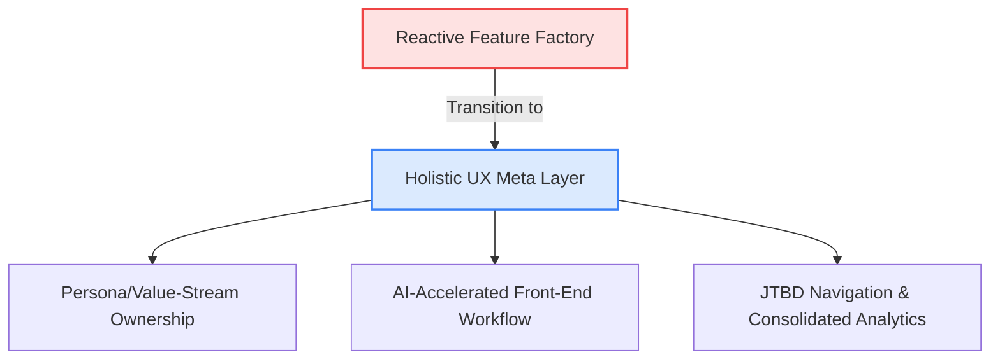
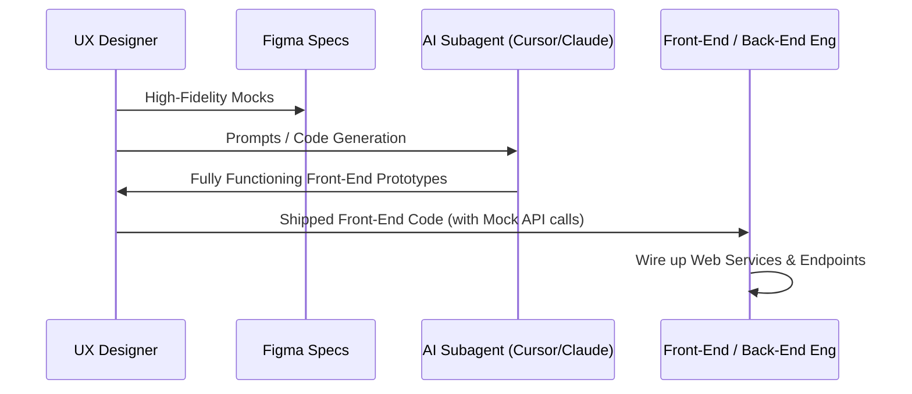
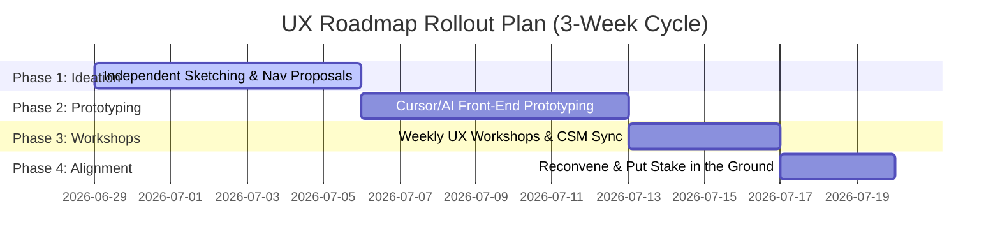

# Impact.com Brand UI - Holistic UX Roadmap
*Master UX Roadmap & Jobs-to-be-Done (JTBD) Streams*

This document serves as the master artifact linking all user journeys, goals, mocks, and in-progress work. It represents a **meta layer above the feature factory**, establishing a holistic UX roadmap separate from the reactive product roadmap. 

Our ultimate goal is to transition our software from a complex utility requiring highly trained Impact personnel into a **self-learnable, high-efficiency workspace** designed around what users are actually trying to accomplish.

---

## ── Executive Summary & Strategic Vision ──



### The Strategic Shift
We are moving away from a model where design reactively slots into product features as they land. Instead:
* **Constructive Tension**: Design will maintain an intentional, constructive tension with Product, reporting directly to leadership (referencing the *Airbnb/Chesky model*) to ensure user advocacy isn't diluted by incremental compromises.
* **Aim for Great from the Start**: We are walking away from the pattern of settling for a "quick version" that takes years to ship. Since coordination overhead is identical, we will aim for premium, fully realized designs from Day 1.
* **AI-Accelerated Delivery**: By leveraging advanced AI tools (like Cursor, Anthropic Claude, and Builder.io), the cost and time of front-end development is reduced by **~100x**. Designers will deliver functioning, interactive front-ends with mocked web services to engineers, bypassing Figma-to-production bottlenecks.

---

## 1. Persona & Value-Stream Ownership Model

To prevent fragmented user experiences, designers are transitioning from squad-level thinking to **persona/value-stream ownership**. Each designer leads a dedicated stream to advocate for specific user archetypes end-to-end.

| Value Stream | Focus Persona | Target Users | Lead Designer | UX Rating & Status |
| :--- | :--- | :--- | :--- | :--- |
| **Partner Stream** | **Affiliate Creator Managers**<br>*(e.g., Priya Nguyen)* | Brands, Influencer Leads, Campaign Specialists | Priya / Marcus Delgado | **Biggest fish to fry right now**<br>🔴 Critical Focus |
| **Publisher Stream** | **Content Commerce / Media**<br>*(e.g., Wirecutter, BuzzFeed)* | Editorial teams, publisher account managers | Albert Lo | **Pretty good**<br>🟡 Stable, needs minor alignment |
| **Brand Stream** | **Marketing Directors & Analysts**<br>*(e.g., Walmart's Aisha Thompson)* | Enterprise decision makers, data analysts | Sarah Chen | **B+**<br>🟢 Solid, requires dashboard review |
| **Agency Stream** | **Multi-Program Agency Leads** | Third-party agencies managing multiple clients | Christine Adams | **Pretty good**<br>🟡 Stable, scaling |

---

## 2. Core UX Initiatives (Jobs-to-be-Done)

### 📂 Initiative A: LeftNav & Reporting Consolidation
* **Problem**: LeftNav (Engage, Discover, Optimize, Protect, Competitive Insights) was structured for cross-selling packages, not for user workflows. Additionally, reports were scattered across Engage and Optimize, forcing users to constantly context-switch to piece together basic statistics.
* **Goal**: Reorganize the entire navigation hierarchy around the **Morning Briefing** and task cadences. Consolidate all reports into a single, comprehensive **Analytics** hub.
* **UX Rating**: **Biggest fish to fry right now**
* **Execution Status**: Nav structure refactored in [LeftNav.tsx](file:///Users/lesleylinnett/Documents/GitHub/one-program-1/src/app/components/LeftNav.tsx).
* **Consolidated LeftNav Spec**:
  ```
  ├── Briefing & Dashboards (Daily Briefing, Recruiting Radar, Campaign Command)
  ├── Partners (Partners list, Groups, Contacts, Messages, Applications, Proposals)
  ├── Campaign Manager (Campaigns, Ad Groups, Creatives)
  ├── Analytics (Unified Hub: Overview, Partner Intel, Data Lab, Action Explorer, Performance)
  └── Contracts & Finance (Template Terms, Custom Terms, Billing, Documents)
  ```

### 📅 Initiative B: User-Defined Operational Cadence & Onboarding
* **Problem**: New signups land in a "squad-organized" default dashboard, placing the burden of organization on the user.
* **Goal**: Implement an onboarding flow where the user defines their operational cadence (e.g., weekly review vs. monthly strategic analysis). The home dashboard dynamically reorganizes its priority modules based on this selection.
* **UX Rating**: **Pretty good**
* **Execution Status**: Interactive cadence card implemented on the Home Dashboard.

### ⚡ Initiative C: Universal Partner Check-In Prep Slide-Out
* **Problem**: Preparing for a partner check-in requires gathering data from five separate screens (revenue, clicks, campaigns, communications, and terms), taking hours of manual prep time.
* **Goal**: Create a universal, one-click slide-out panel that surfaces a "Preparing for Check-in" briefing. This includes a performance trend graph, key talking points, a verification checklist, and direct action items (e.g., issue bonus, change terms).
* **UX Rating**: **B+**
* **Execution Status**: Integrated within the [PartnerSlideout.tsx](file:///Users/lesleylinnett/Documents/GitHub/one-program-1/src/app/components/PartnerSlideout.tsx) component.

### 🤖 Initiative D: The Weekly Briefing Agent
* **Problem**: Campaign managers suffer from cognitive overload, trying to parse 6+ tabs in the campaign manager and long-form tables to see what requires attention.
* **Goal**: Introduce a "Briefing Agent" that translates the manager's core job description into actionable recommendations on the dashboard (e.g., "Top 5 partners worth doubling down on", "Content review queue", and "To-dos").
* **UX Rating**: **Biggest fish to fry right now**
* **Execution Status**: Implemented under the Daily Briefing section in [InboxZeroDashboard.tsx](file:///Users/lesleylinnett/Documents/GitHub/one-program-1/src/app/components/InboxZeroDashboard.tsx).

---

## 3. Operational Plan: The AI-Accelerated Front-End Pipeline

To scale this UX vision and bypass traditional engineering backlogs, the design team is adopting a **100x efficiency front-end prototype workflow**.



### Key Practices:
1. **Designers as Code Owners**: UX Designers will build and iterate on high-fidelity, functional web prototypes. The UI output is what matters, not the underlying framework dependencies.
2. **Early Engineering Integration**: Engineers will join early in the prompting phase (e.g., in Cursor or Claude) to inspect code patterns and structure, rather than receiving a late-stage waterfall handoff.
3. **Decoupled API Development**: Prototypes will run on local mock service calls. Front-ends can be deployed immediately to user-testing channels, while back-end engineers incrementally wire up live endpoints.

---

## 4. Rollout Plan & Next Steps



1. **Immediate Task**: Each designer will independently sketch a new navigation and dashboard concept.
2. **Weekly Rhythm**: Establish weekly or biweekly cadenced workshops to crowdsource ideas, "throw everything out, start fresh," and review prototype interactions.
3. **Executive Alignment**: Lesley to meet with Albert Lo this week to align on the overall roadmap direction.
4. **Milestone (2.5 Weeks)**: Reconvene the entire team to put a stake in the ground, merge the prototypes, and finalize the layout for the executive presentation to the founder.

---

> [!NOTE]
> *This document is actively maintained by Lesley and Per. Ratings are updated dynamically based on user feedback and session analysis.*
> 
> **Related Artifacts:**
> *   [Affiliate Creator Manager PRD](file:///Users/lesleylinnett/Documents/GitHub/one-program-1/affiliate-creator-manager-prd.md)
> *   [Dashboard Pages Directory](file:///Users/lesleylinnett/Documents/GitHub/one-program-1/src/app/pages)
