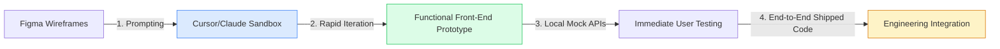

# Impact.com Brand UX: Team Operational Playbook
*How We Deliver the Founder's UX Vision (AI-Accelerated Model)*

This playbook translates the high-level meeting notes between Per and Lesley into a concrete, repeatable operational workflow for the design and engineering teams. It details the **Strategic Shift**, the **Persona Value-Stream Model**, and the **AI-Accelerated Prototyping Pipeline** designed to hit our milestone targets in 3 weeks.

---

## 1. The Strategy: Shifting from "Feature Factory" to "Holistic UX"

### The Problem We are Solving
Our platform currently feels like a collection of features organized by our internal engineering squads rather than a cohesive product. This creates severe usability hurdles:
1. **The Toggle Problem**: Users are forced to toggle between different programs to view performance and manage relationships.
2. **Fragmented Workflows**: Performing a simple partner check-in requires clicking through 5 different places across the platform (Engage, Discover, Optimize, etc.).
3. **High Cognitive Load**: Interfaces like the Campaign Manager require digging through 6 tabs and parsing long-form inputs to piece together creator performance.

### The Solution: A Jobs-to-be-Done (JTBD) Paradigm
We are restructuring the product around **what the user is trying to accomplish at any given moment**, utilizing their calendar signals and behavioral patterns to adapt the UI. 

```
                                ┌────────────────────────┐
                                │   Morning Dashboard    │
                                └───────────┬────────────┘
                                            │
                     ┌──────────────────────┼──────────────────────┐
                     ▼                      ▼                      ▼
           [ Daily Briefing ]       [ Recruiting Radar ]   [ Campaign Command ]
           Daily scan & actions     Find new partners      Monitor active campaigns
```

---

## 2. Team Structure: Persona & Value-Stream Ownership

Designers will no longer be locked into engineering squads. Instead, each designer owns a **Value Stream** representing a key user segment, ensuring user advocacy throughout the product lifecycle.

### Value-Stream Assignments & Goals

#### 🔴 Partner Stream (Lead: Priya / Marcus Delgado)
* **Target User**: Affiliate Creator Managers (e.g., *Priya Nguyen*)
* **Primary Focus**: Recruiting, onboarding, relationship management, and influencer/affiliate alignment.
* **Core Goal**: Merge creator and affiliate workflows into a single experience. Eliminate context-switching and toggle friction.
* **Rating**: **Biggest fish to fry right now**

#### 🟡 Publisher Stream (Lead: Albert Lo)
* **Target User**: Content Commerce / Media publishers (e.g., *CNN*, *Wirecutter*, *BuzzFeed*)
* **Primary Focus**: Publisher analytics, performance by partner, and media integration.
* **Core Goal**: Consolidate reports. Create a single page to view everything about a publisher.
* **Rating**: **Pretty good**

#### 🟢 Brand Stream (Lead: Sarah Chen)
* **Target User**: Marketing Directors, Enterprise Admins, Analysts (e.g., *Walmart's Aisha Thompson*)
* **Primary Focus**: Daily scanning, anomaly detection, strategic planning, and overall business health.
* **Core Goal**: Create a "mega-optimized" analytics dashboard that relieves pressure on the primary dashboard.
* **Rating**: **B+**

#### 🟡 Agency Stream (Lead: Christine Adams)
* **Target User**: Multi-Program Agency Account Managers
* **Primary Focus**: Cross-program reporting, client management, and agency workflows.
* **Core Goal**: Build client-switching and aggregated portfolio views that require zero context loss.
* **Rating**: **Pretty good**

---

## 3. The New Workflow: AI-Accelerated Prototyping

To match the dropping costs of front-end construction (a ~100x decrease in time and expense), we are abandoning the slow, waterfall "Figma-to-Specs-to-Jira" pipeline.



### Protocol for Designers
1. **Design Mocks in Figma**: Focus on layout, visuals, and user flows.
2. **Translate to Functional Front-end**: Use AI coding assistants (like Cursor, Claude) to build fully functional React/HTML pages.
3. **Decouple from Backend**: Write local JSON mock arrays and client-side logic to simulate state changes (e.g., issuing a welcome bonus, changing partner terms).
4. **Iterate Fast**: Use the interactive prototype to test flows with actual users and stakeholders *before* handing it to engineering.

### Protocol for Engineers
1. **Join Early**: Participate in prompting and design reviews. Inspect the generated prototype's DOM and component hierarchy.
2. **Bypass Boilerplate**: Do not rebuild the UI from scratch. Take the completed, styled front-end component directly.
3. **Wire Services**: Replace the local mock service calls with actual backend API connections and database calls.

---

## 4. Immediate Action Plan & Milestones

Our target is to align on the final dashboard and navigation architecture in **2.5 weeks**.

### Week 1: Ideation & Sketching (June 29 - July 5)
* **Action**: Every designer independently sketches a new navigation hierarchy and dashboard concept for their stream.
* **Workshop 1**: Review sketches as a team. Focus on resolving the "cross-sell nav vs. user-centric nav" dilemma.

### Week 2: AI Prototyping (July 6 - July 12)
* **Action**: Build out the unified LeftNav structure and the three main Briefing/Dashboard layouts using Cursor.
* **Workshop 2**: Run usability walkthroughs of the interactive prototypes. Critique transition animations, slide-outs, and dashboard card layouts.

### Week 3: Consolidation & Stake-in-the-Ground (July 13 - July 17)
* **Action**: Integrate the Partner Check-In Prep slide-out and the Analytics Hub into the master prototype.
* **Milestone**: Reconvene for a final review session to put a stake in the ground and prepare the presentation deck for the founder.

---

> [!TIP]
> *By aligning early and utilizing Cursor to build high-fidelity interactive pages, we can show the founder a fully realized, live prototype of the new Brand UI within weeks, rather than months.*
