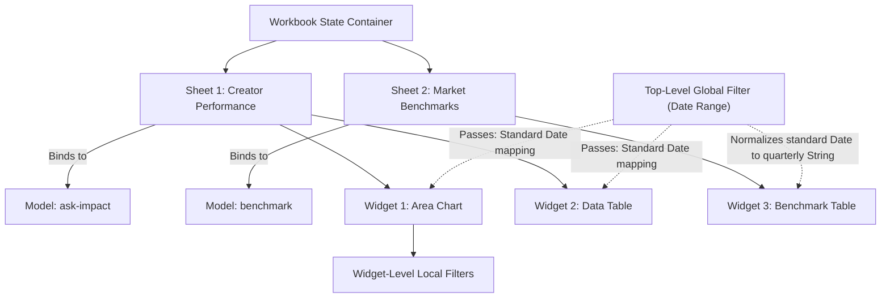

# Data Lab Multi-Model Architecture Build Instructions

This document provides product requirements and implementation instructions for prototyping Data Lab V2, which introduces a multi-model architecture to enable users to access different datasets simultaneously. This prototype will live alongside the existing Data Lab version, preserving V1 functionality for side-by-side verification and avoiding regression risk for users relying on the single-model experience.

---

## 1. Context & Business Case

### Current Limitation
In the current Data Lab V1, users can only query a single data model at a time. The datasets are split across three incompatible interfaces:
* Partners with Trackonomics get a separate dataset restricted to exactly 20 dimensions/measures.
* Ask Impact queries a different set of data containing creator metrics, landing page actions, and affiliate network data.
* Benchmark data contains quarterly benchmarks which use different date granularities.

Users are unable to see their creator performance, landing page conversions, and quarterly benchmark data together inside the same workbook to build custom holistic reports.

### Proposed Solution
An Excel-like workbook approach will be implemented on the front-end to avoid backend schema restructuring:
* A single workbook contains multiple sheets.
* Each sheet binds to exactly one data model (e.g. Trackonomics, Ask Impact, or Benchmark).
* Users can build widgets (charts/tables) on any sheet, inheriting the sheet's model.
* A tabbed sheet interface allows toggling between datasets.
* Users can view and analyze multiple sheets within a single workbook.

---

## 2. Goals & Non-Goals

### Goals
* Enable simultaneous access to multiple datasets via separate sheets in a single workbook view.
* Implement a robust filter architecture that gracefully handles date and field incompatibilities between models.
* Use normalization layers to map standard global filters to model-specific formats (e.g., calendar date to quarterly strings).
* Communicate filter limitations transparently using custom invalid/not-applied chip states and widget headers.
* Deliver the features as a parallel component ("Data Lab V2") in the app, leaving V1 files completely untouched.

### Non-Goals
* No modifications to backend database schemas or endpoints. All data stitching, tab grouping, and filter mapping are handled in the front-end layer.
* Advanced front-end data stitching (joins, merges, cross-sheet calculated cells) is deferred for future iterations; the prototype will only display a placeholder for this function.

---

## 3. User Types & Jobs-to-be-Done

### High-Level Marketing Managers (90% of Users)
* **Job**: Monitor high-level snapshots of affiliate campaigns and creator activity.
* **Behavior**: Primarily look at a single, well-structured data table or summary numbers. They do not understand the underlying technical schema.
* **V2 Impact**: Need a simple interface where pre-configured multi-model sheets render without breaking. Filter warning notifications must be clear and non-technical.

### Deep Analytical Users (10% of Users)
* **Job**: Run deep, custom queries across creator channels, landing page interactions, and network transactions.
* **Behavior**: Build complex layouts, drag and drop columns, apply customized local filters, and compare performance trends against benchmarks.
* **V2 Impact**: Require control over sheet bindings, widget-level override filters, and clear error reasons when drag-and-drop actions are incompatible with the sheet's data model.

---

## 4. Workbook Conceptual Model

A Workbook acts as the top-level state container. It manages one or more Sheets, each of which is bound to a single Data Model. Widgets exist within a Sheet, inheriting its data model, and can be customized with dimensions, measures, and local filters.



---

## 5. Data Model Registry

To support multi-model operations, we must extract and define structured representations of our data models. A schema registry will govern dimensions, measures, date semantics, and filtering capabilities.

Create a new file [src/app/data-lab/models.ts](file:///Users/lesleylinnett/Documents/GitHub/Brandui/src/app/data-lab/models.ts) to define these structures.

### Types & Interfaces

```typescript
export type FieldType = "abc" | "123" | "date" | "link";

export interface DataField {
  id: string;
  label: string;
  type: FieldType;
}

export interface DateFilterSemantics {
  type: "standard" | "quarter-string";
  format?: string; // e.g. "YYYY-MM-DD" or "YYYY-[Q]Q"
}

export interface FilterCapability {
  supportedOperators: ("equals" | "contains" | "between" | "in")[];
  honorsTopLevelFilters: string[]; // List of global filter keys it accepts
}

export interface DataModel {
  id: string;
  label: string;
  dimensions: DataField[];
  measures: DataField[];
  dateSemantics: DateFilterSemantics;
  filterCapability: FilterCapability;
}
```

### Seeding Mock Models

Define and export three static data models in [models.ts](file:///Users/lesleylinnett/Documents/GitHub/Brandui/src/app/data-lab/models.ts):

1. **trackonomics**
   * **Dimensions**: `partner`, `device`, `channels`, `media_source`
   * **Measures**: `clicks`, `revenue`, `action_cost`, `cpa`
   * **Date Semantics**: `standard`
   * **Filter Capabilities**: Honors `date`, `partner`

2. **ask-impact**
   * **Dimensions**: `partner`, `device`, `channels`, `creator_name`, `landing_page_url`, `social_platform`, `media_source`
   * **Measures**: `clicks`, `impressions`, `revenue`, `action_cost`, `cpa`, `social_engagements`, `page_views`
   * **Date Semantics**: `standard`
   * **Filter Capabilities**: Honors `date`, `partner`, `creator`

3. **benchmark**
   * **Dimensions**: `quarter`, `industry_vertical`, `partner`
   * **Measures**: `benchmark_conversion_rate`, `benchmark_cpc`, `market_share`
   * **Date Semantics**: `quarter-string` (Granularity restricted to quarterly values, e.g., "2026-Q1")
   * **Filter Capabilities**: Honors `date` (requires quarterly normalization), `partner`

---

## 6. Filter Architecture

Filters are processed in two scopes:
1. **Top-level Filters**: Renders in the header bar above the workspace canvas. Applies to all widgets across all sheets, provided the widget's underlying model is compatible.
2. **Widget-level Filters**: Renders inside the right-hand widget configuration sidebar. Represents local overrides and specific model constraints.

### Date Filter Normalization Layer

When a top-level date filter changes, it must be translated to the date granularity expected by each sheet. Create this utility function inside [src/app/data-lab/filters.ts](file:///Users/lesleylinnett/Documents/GitHub/Brandui/src/app/data-lab/filters.ts):

```typescript
export interface StandardDateRange {
  start: string; // YYYY-MM-DD
  end: string;   // YYYY-MM-DD
}

export function toModelDate(range: StandardDateRange, model: DataModel): any {
  if (model.dateSemantics.type === "quarter-string") {
    const startYear = new Date(range.start).getFullYear();
    const startMonth = new Date(range.start).getMonth();
    const endYear = new Date(range.end).getFullYear();
    const endMonth = new Date(range.end).getMonth();

    const quarters: string[] = [];
    let currYear = startYear;
    let currMonth = Math.floor(startMonth / 3) * 3;

    while (currYear < endYear || (currYear === endYear && currMonth <= endMonth)) {
      const q = Math.floor(currMonth / 3) + 1;
      quarters.push(`${currYear}-Q${q}`);
      currMonth += 3;
      if (currMonth >= 12) {
        currMonth = 0;
        currYear += 1;
      }
    }
    return quarters; // Returns e.g. ["2026-Q1", "2026-Q2"]
  }
  return range;
}
```

### Validation Reason Taxonomy

To alert users when compatibility rules are broken, configure a taxonomy of invalid reasons. We will reuse the styling of the red, dashed outlined chips already implemented in the right-hand panel of V1 [ReportCanvas.tsx](file:///Users/lesleylinnett/Documents/GitHub/Brandui/src/app/components/ReportCanvas.tsx):

```typescript
export interface FieldInvalidReason {
  type: "incompatible-with-chart" | "incompatible-with-model" | "filter-not-applied";
  message: string;
}
```

#### Application Rules
* **Incompatible with Model (`incompatible-with-model`)**: Occurs when a field belonging to Model A is dropped onto a sheet bound to Model B.
  * *UI Render*: Chip changes to red-outlined dashed mode. Tooltip display: `Field is not supported by the sheet's active model (${modelId}).`
* **Incompatible with Chart (`incompatible-with-chart`)**: Occurs when a dimension or measure is applied to a chart that does not support it (e.g., putting a text field into a numeric Y-axis).
  * *UI Render*: Chip changes to red-outlined dashed mode. Tooltip display: `Field type cannot be rendered on a ${chartType} visualization.`
* **Filter Not Applied (`filter-not-applied`)**: Occurs when a top-level global filter is ignored by a widget because the widget's model does not support it.
  * *UI Render*: 
    1. A small warning badge `N filters not applied` appears on the top-right corner of the Widget header.
    2. A corresponding red outline pill is rendered in the widget-level filter bar within the configuration panel, with tooltip display: `Global filter ${filterId} cannot be applied to this model.`

---

## 7. Workbook UI & State Schema

The Workbook interface uses a tabbed layout to transition between sheets. This layout will be built using the tabs library in [tabs.tsx](file:///Users/lesleylinnett/Documents/GitHub/Brandui/src/app/components/ui/tabs.tsx).

### Workbook React State Model

Store this state inside a new React Context or within the parent container of the workbook canvas:

```typescript
export interface WidgetState {
  id: string;
  chartType: string;
  title: string;
  columns: string[]; // Dimension keys
  xAxis: string | null;
  yAxis: string[];   // Measure keys
  filters: { fieldId: string; operator: string; value: any }[]; // Local overrides
  x: number;
  y: number;
  w: number;
  h: number;
}

export interface SheetState {
  id: string;
  title: string;
  modelId: string; // "trackonomics" | "ask-impact" | "benchmark"
  widgets: WidgetState[];
}

export interface WorkbookState {
  activeSheetId: string;
  sheets: SheetState[];
}
```

### Sheet Creation Flow
1. User clicks the "+" tab button at the top of the canvas.
2. A Dialog modal appears prompting the user to select the **Data Model** (Trackonomics, Ask Impact, or Benchmark).
3. Once selected, the user is redirected to the Chart Type grid (reused from [DataLabBuilder.tsx](file:///Users/lesleylinnett/Documents/GitHub/Brandui/src/app/components/DataLabBuilder.tsx)) to select the initial sheet widget layout.
4. Clicking "Create" appends a new tab to the workbook state.

---

## 8. Mixed-Model Example Templates

To demonstrate the capabilities and limitations of the multi-model architecture, seed the prototype workbook with three default templates.

Create a new file [src/app/data-lab/templates.ts](file:///Users/lesleylinnett/Documents/GitHub/Brandui/src/app/data-lab/templates.ts) to export these static templates:

### Template 1: Affiliate Snapshot
* **Scope**: Single Model (`ask-impact`)
* **Purpose**: Serves high-level managers.
* **Layout**:
  * Tab Title: `Affiliate Overview`
  * Widget 1: Number KPI card displaying total `revenue`.
  * Widget 2: Data Table listing top 10 values by `creator_name` and `clicks`.

### Template 2: Creator Deep Dive
* **Scope**: Multi-Model (`ask-impact` + `trackonomics`)
* **Purpose**: Demonstrates multi-sheet navigation and top-level filter application.
* **Layout**:
  * Tab 1: `Creator Networks` (Model: `ask-impact`)
    * Widget 1: Area Chart mapping `clicks` by `creator_name` over time.
  * Tab 2: `Device Distribution` (Model: `trackonomics`)
    * Widget 1: Donut Chart showing `clicks` split by `device`.
  * *Top-Level Filters*: A shared date range filter that applies to both sheets.

### Template 3: Benchmark vs Performance
* **Scope**: Multi-Model with incompatible date types (`benchmark` + `ask-impact`)
* **Purpose**: Visualizes quarterly date normalization and fallback widget-level warnings.
* **Layout**:
  * Tab 1: `Quarterly Benchmarks` (Model: `benchmark`)
    * Widget 1: Table comparing `industry_vertical`, `benchmark_cpc`, and `market_share`.
  * Tab 2: `Daily Live Performance` (Model: `ask-impact`)
    * Widget 1: Line Chart displaying daily `revenue` and `cpa` values.
  * *Behavior*:
    * Selecting the date range "2026-01-01 to 2026-06-30" translates to `["2026-Q1", "2026-Q2"]` for Tab 1, and translates to standard dates for Tab 2.
    * When a filter parameter like `social_platform = 'Instagram'` is set globally, Tab 1 displays a warning badge `1 filter not applied` since the `benchmark` model does not recognize `social_platform`.

---

## 9. Front-End Stitching Roadmap

Front-end stitching allows joining data fields across sheets. While out-of-scope for the first prototype, the interface will layout a future roadmap description to clarify the feature set.

### Interaction Stub
Provide a "Combine Sheets" button in the workbook header toolbar. Clicking it opens a Dialog displaying:
* **Status**: "Coming Soon"
* **Technical Roadmap Outline**:
  1. **Join Keys Identification**: Explain how the front-end will automatically map matching dimension columns (e.g. `partner` from Trackonomics to `partner` from Ask Impact).
  2. **Conflict Resolution**: Highlight rules for field column clashes (e.g. if both models contain `revenue`, the application will append the model name: `revenue (trackonomics)` vs `revenue (ask-impact)`).
  3. **Join Strategy**: Users will select whether to perform a Full Outer Join, Left Join, or Inner Join directly inside the visual canvas dashboard.

---

## 10. Phased Implementation Checklist

A developer can build the workbook interface using this step-by-step checklist:

### Phase 1: Filters & Data Registry
* [ ] Create [models.ts](file:///Users/lesleylinnett/Documents/GitHub/Brandui/src/app/data-lab/models.ts) containing types and mock data arrays.
* [ ] Create [filters.ts](file:///Users/lesleylinnett/Documents/GitHub/Brandui/src/app/data-lab/filters.ts) and write the `toModelDate` normalizer function.
* [ ] Modify [ReportCanvas.tsx](file:///Users/lesleylinnett/Documents/GitHub/Brandui/src/app/components/ReportCanvas.tsx) chip-rendering logic:
  * [ ] Introduce `ChipReason` types.
  * [ ] Render red dashed border styling if a chip has a reason.
  * [ ] Add tooltip descriptive messages on hover.

### Phase 2: Workbook Structure
* [ ] Add route `/reports/data-lab-v2` in [routes.tsx](file:///Users/lesleylinnett/Documents/GitHub/Brandui/src/app/routes.tsx) mapping to a new page file [DataLabV2Page.tsx](file:///Users/lesleylinnett/Documents/GitHub/Brandui/src/app/pages/DataLabV2Page.tsx).
* [ ] Add route `/reports/data-lab-v2/builder` mapping to [DataLabV2BuilderPage.tsx](file:///Users/lesleylinnett/Documents/GitHub/Brandui/src/app/pages/DataLabV2BuilderPage.tsx).
* [ ] Build a new workbook container component `DataLabWorkbook.tsx` that uses [tabs.tsx](file:///Users/lesleylinnett/Documents/GitHub/Brandui/src/app/components/ui/tabs.tsx).
* [ ] Wire the sheet creation modal to request a Data Model, then display the chart grid picker.

### Phase 3: Seeding Examples
* [ ] Create [templates.ts](file:///Users/lesleylinnett/Documents/GitHub/Brandui/src/app/data-lab/templates.ts) with the three static schemas.
* [ ] Build a template loader on the V2 landing page to allow users to load `Affiliate Snapshot`, `Creator Deep Dive`, or `Benchmark vs Performance`.

### Phase 4: Stitching Stub
* [ ] Render the "Combine Sheets" button in the workbook header.
* [ ] Hook it up to open a Dialog stub explaining the stitching mechanics.

---

## 11. Acceptance Criteria per Phase

### Phase 1 Criteria
* Importing `toModelDate` with inputs `2026-01-01` to `2026-04-15` returns `["2026-Q1", "2026-Q2"]` when bound to the benchmark model.
* Dragging an ask-impact field into a benchmark-bound sheet turns the column chip red and displays the correct invalid-model tooltip message.

### Phase 2 Criteria
* Toggling workbook sheet tabs mounts/unmounts corresponding canvas states.
* Creating a sheet dynamically updates the tab collection and maps correct dimension list options in the sidebar.

### Phase 3 Criteria
* Loading the "Benchmark vs Performance" template renders the two sheets.
* Changing the global date range updates the charts on both sheets without throwing rendering runtime errors.

### Phase 4 Criteria
* Clicking the "Combine Sheets" button displays a clean overlay dialogue detailing join keys and column conflicts.

---

## 12. Open Questions for Product

* **High-Level Managers**: Since standard calendar filters map to quarter strings under the hood, how should we message this translation in the UI without confusing non-technical users?
* **Join Keys Configuration**: If sheets are merged in the future, should we enforce predefined join key mappings in the metadata registry, or let users choose arbitrary dimensions for joins?
* **Local Widget Filter Override**: When a widget contains a local override filter, should it completely override the global top-level filters, or should they combine using an AND logic?
